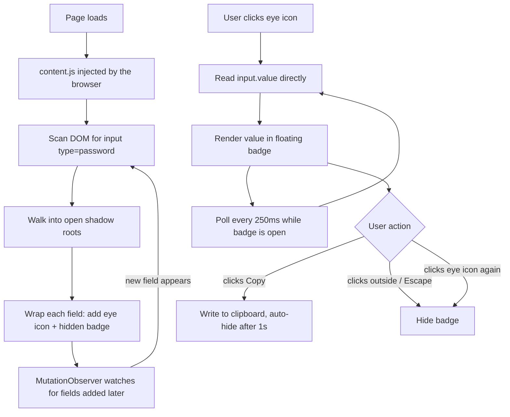
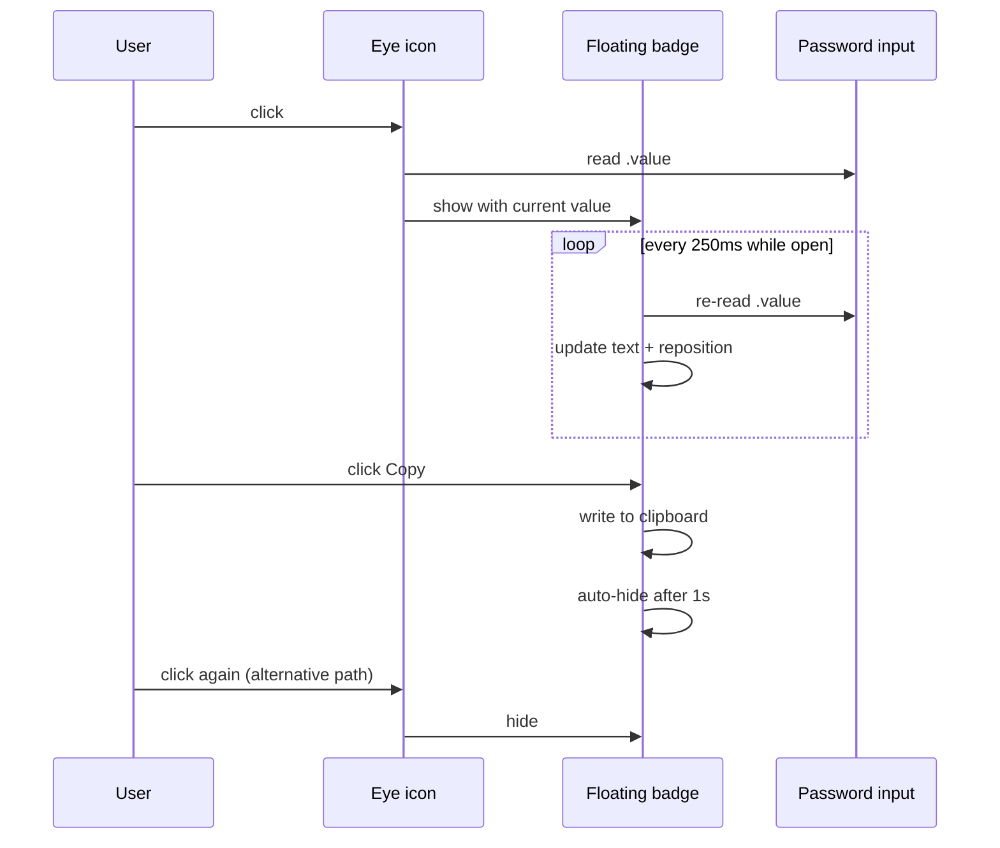

# RevealX Design 👀

## The problem 😒

Password fields in the browser are rendered as dots or asterisks by design.
That's correct behavior for a login form someone else might be looking over
your shoulder at. It becomes a real annoyance in a different context: your
own machine, your own browser, testing your own API or form, where you typed
the value yourself two seconds ago and now can't verify what actually landed
in the field.

This shows up constantly in day to day development work: checking a
generated password before submitting a signup form, verifying an OAuth
client secret pasted into a Swagger/OpenAPI "Try it out" panel, debugging why
a login test keeps failing when you can't tell if the field has a trailing
space in it. The masking that protects users in public is the same masking
that gets in a developer's way in private.

The obvious fix, a browser extension that reveals the value, exists in
several forms already. The interesting part of this project wasn't the idea,
it was getting a naive version of it to actually survive contact with modern
frontend frameworks.

## First attempt, and why it failed

The first version toggled the field's `type` attribute directly:

```js
input.type = input.type === "password" ? "text" : "password";
```

This works on a static HTML page. It falls apart on anything built with
React, Vue, or similar, which is most real-world login and API testing UIs
today (Swagger UI included). Here's why:

Frameworks like React keep an internal record of what each DOM node should
look like, and reconcile the real DOM against that record on every render.
When this extension sets `input.type = "text"` from outside, the browser
updates immediately, but React has no idea the change happened. The next
time *anything* triggers a re-render of that component, whether that's the
user typing in an unrelated field, or toggling an unrelated checkbox, React
writes the attribute back to what its own state says it should be:
`type="password"`. The toggle appears to work for a fraction of a second and
then silently reverts, with no error and no obvious cause. This is exactly
what happened testing against a FastAPI Swagger docs page: the eye icon
flipped state, but the field kept showing dots, because some unrelated
re-render kept winning the fight over the `type` attribute.

## The fix: stop fighting for control

The insight that made this work reliably: mutating a framework-controlled
element is unsafe, but *reading* from it is always safe. `input.value`
reflects whatever the user actually typed regardless of what the framework
thinks the DOM should look like. Frameworks reconcile attributes and
children, they don't intercept property reads.

So instead of changing the field itself, RevealX reads `input.value` and
displays it in a separate floating tooltip that the extension fully owns.
Nothing about the password field is touched, so there's nothing for the
framework to fight over or reset.

This single change is what makes the extension framework-agnostic. It works
identically whether the underlying page is static HTML, React, Vue, or a web
component, because it never enters into a disagreement with any of them
about what the DOM should contain.

## Filling in the remaining gaps

Reading `.value` on click covers typing, but two more cases needed handling:

- **Programmatic value changes.** A password manager, autofill, or a script
  can set `.value` without firing a normal keyboard event. A `setInterval`
  poll (250ms, only while the tooltip is open) catches these without relying
  on any specific event firing.
- **Shadow DOM.** Some component libraries render inputs inside a shadow
  root, which a plain `querySelectorAll` doesn't see into. RevealX walks
  into any *open* shadow root it finds. Closed shadow roots
  (`{ mode: "closed" }`) are unreachable by design, by any script, extension
  or otherwise. That's not a gap to fix, it's the platform doing what it's
  supposed to.

## Architecture

Single content script, no background worker, no permissions beyond running
on page load. There's no server, no network calls, and no data leaves the
browser tab at any point.



### Why a floating badge instead of an inline overlay

The badge is appended to `document.body` and positioned with
`getBoundingClientRect()`, rather than being nested inside the page's own
layout. This avoids two problems: the host page's `overflow: hidden` or
`z-index` stacking rules can't clip or bury it, and inserting extra DOM
directly next to a framework-managed input risks the framework re-rendering
that region and discarding our node the same way it discarded the `type`
mutation in the first attempt.

## Interaction lifecycle



## Known limitations

- Closed shadow roots cannot be reached. Not a bug, a platform guarantee.
- Cross-origin iframes (common in embedded payment widgets) are outside the
  same-origin policy this extension operates under. No extension can reach
  across that boundary.
- Fields that aren't real `<input>` elements at all (canvas-rendered inputs,
  some high-security fintech UIs) have nothing for a DOM-based approach to
  read.
- This has been tested against a handful of real sites and a purpose-built
  test harness, not a broad matrix of frameworks and browsers. Treat it as a
  solid personal/dev tool, not a hardened, widely-verified product.

## What this is not

This does not defeat any server-side security control. It reveals a value
that was already sitting in plaintext in the page's own memory, visible to
any script running on that page, extension or otherwise. It cannot recover a
password you didn't type, reveal another user's session, or bypass
authentication anywhere. The only thing it changes is whether *you* can see
what you already typed.

## Contributing

The codebase is intentionally small (two files, no build step, no
dependencies) so it's easy to read start to finish in a few minutes. Good
first contributions: broader test coverage across real sites, an options
page to scope which domains it runs on, a Firefox-compatible manifest
variant.
