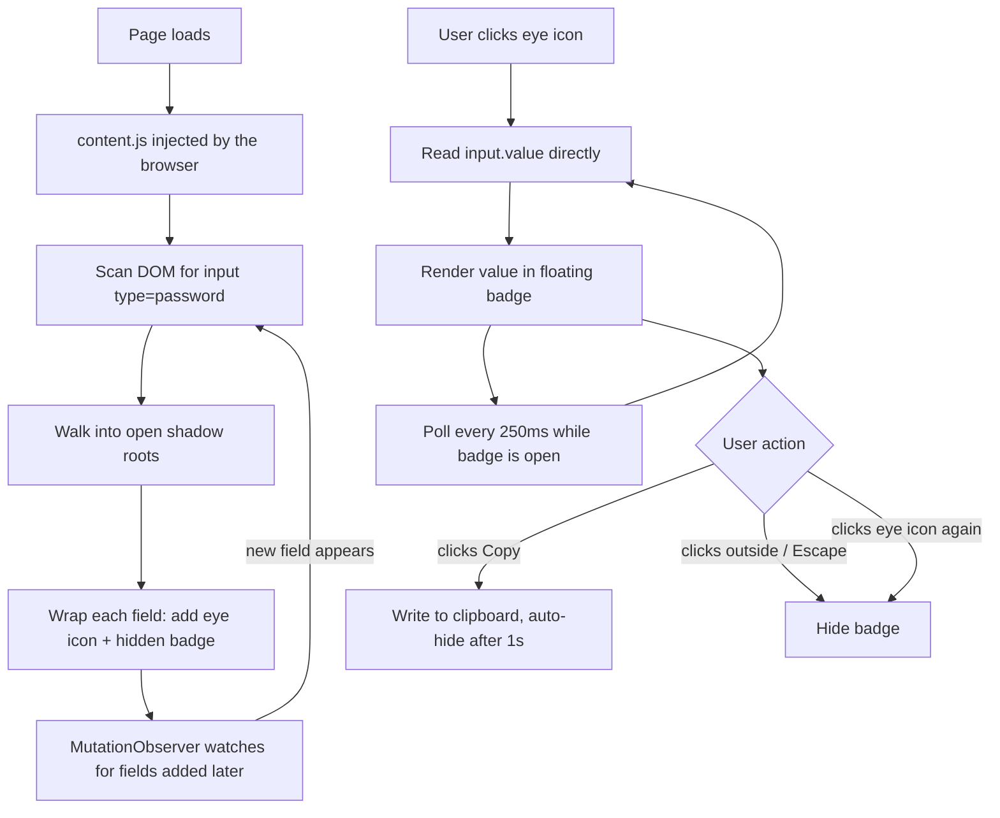
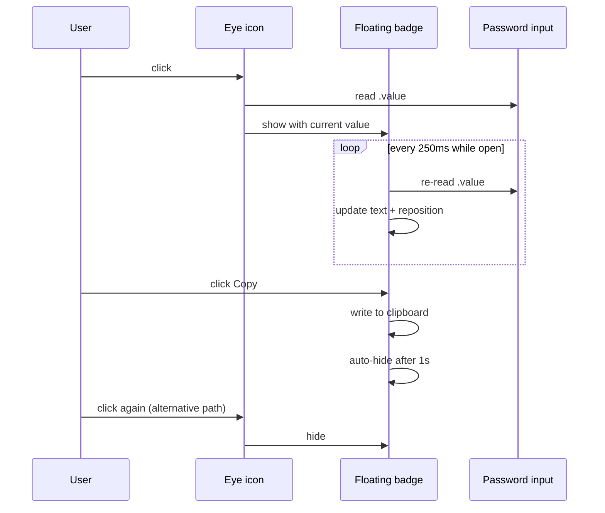

### RevealX 


A browser extension that shows the actual value typed into a password
field, on demand, without breaking on React, Vue, or other frameworks that
re-render the field and undo naive attempts at this.

See [DESIGN.md](./DESIGN.md) for the reasoning behind how this works, why a
more obvious approach (toggling the field's `type` attribute) fails on
modern frontends, and the architecture diagrams.

## What it does

Adds a small eye icon inside every password field on a page. Clicking it
opens a floating tooltip showing the field's current value in plain text,
live-updated as you type, with a copy button. Clicking the icon again, the
Escape key, or clicking outside the tooltip closes it.

## Install

This isn't published to a browser extension store. Load it manually:

**1.  Clone or download this repository.**
   - Clone this repo
     ```bash
     https://github.com/SalmanDeveloperz/revealX.git
     ```

        **OR**
  
   - Click on the **Download ZIP** button
     
     

**2. Open `chrome://extensions` (or `edge://extensions` on Edge).**

**3. Turn on **Developer mode** (top right).**

**4. Click **Load unpacked** and select the `revealx` folder.**

No permissions are requested. The extension reads the **DOM** of the current
page only; nothing is sent anywhere.

## Usage

Click the **eye** 👁 icon next to any password field to reveal its current value.
Click the **Copy** 📋 button in the tooltip to copy it to your clipboard, the
tooltip closes automatically about a second after a successful copy.

## Testing

A local test harness is included at `test-page.html`, covering the cases
that actually break naive implementations: a plain input, a field that
mimics a React component fighting to reset its own state, a field whose
value is set programmatically with no keystrokes, and a field inside an
open shadow root.

Content scripts don't run on `file://` pages by default, so serve it:

```bash
cd revealx
python3 -m http.server 8000
```

Then open `http://localhost:8000/test-page.html`.


## Architecture



## Interaction lifecycle




## Limitations

- Closed shadow roots (`{ mode: "closed" }`) can't be reached, by design of
  the platform, not a bug in this extension.
- Cross-origin iframes are outside what any extension can read into.
- Fields that aren't real `<input>` elements (canvas-rendered inputs in some
  high-security UIs) have nothing for this to read.

Full detail on all of this is in [DESIGN.md](./DESIGN.md).

## What this is not

This doesn't bypass any server-side authentication or security control. It
only reveals a value already sitting in plaintext in the page's own memory,
the same value any script running on that page could already read. It
cannot recover a password you didn't type, or reveal anyone else's
credentials.

## License

MIT, see [LICENSE](./LICENSE).

<p align="center">
  <a href="https://github.com/SalmanDeveloperz">
    
  </a>
</p>
